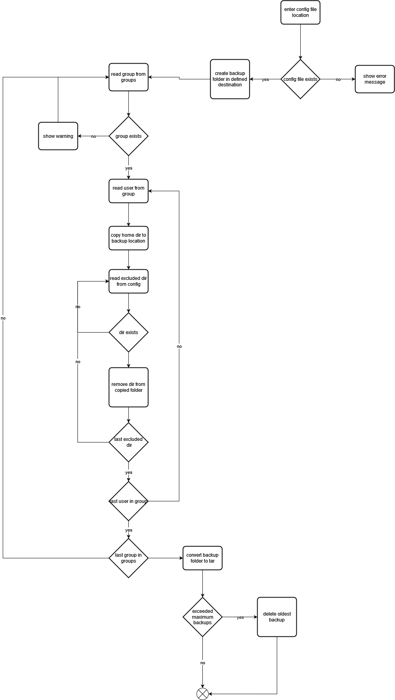

# Projekt Dokumentation

[[_TOC_]]

## Lösungsdesign
Anhand der Analyse wurde folgendes Lösungsdesign entworfen.

## Aufruf der Skripte

### Backup Script
Wird nur mit dem Ort der Haup-Konfigurationsdatei aufgerufen

## Activity Diagrams
(addUserScript.png "diagram")

### Backup Script

## Konfigurationsdateien

### Add User Script
- vorhandene Gruppen
- gruppierung aller Users
- template struktur

### Backup Script
- maximale anzahl backups
- ort des Haup-Backupordners
- prefix der einzenlnen Backupdateien
- betroffene Gruppen
- exclusions für spezifische Gruppen

TODO: Definieren sie welche Parameter in welchen Konfigurationsdateien gespeichert werden.

## Abgrenzungen zum Lösungsdesign

TODO: Nachdem das Programm verwirklicht wurde, hier die Unterschiede von der Implementation zum Lösungsdesign beschreiben (was wurde anders gemacht, was wurde nicht gemacht, was wurde zusaetzlich gemacht)